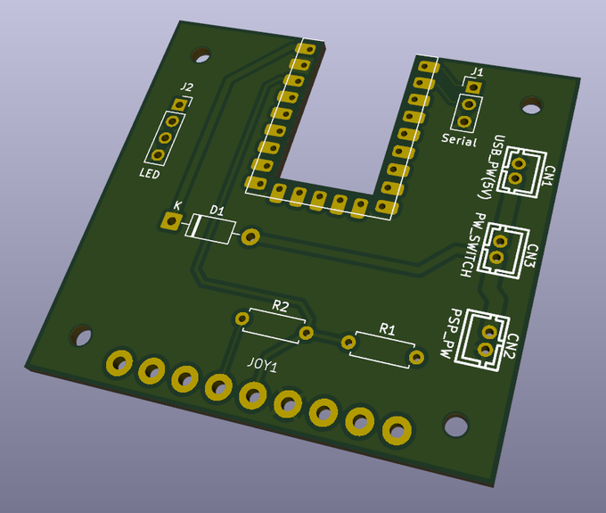

RemoteJoyMinus Standalone USB Host Probe
========================================

This standalone USB host build enumerates the PSP running remotejoy-minus.prx,
opens the RemoteJoyMinus bulk endpoints, runs the HostFS-compatible hello
handshake, and sends RemoteJoyMinus JoyEvent packets from RP2040 input.

Build
-----

Use Pico SDK:

	mkdir -p build
	cd build
	cmake .. -DPICO_SDK_PATH=/path/to/pico-sdk
	make

Flash remotejoy_minus_standalone_usbhost.uf2 to the RP2040-zero.

Wiring and Logs
---------------

The RP2040-zero USB port is used as USB host, so USB serial logging is disabled.
Logs go to UART stdio. On the default Pico SDK settings this is UART0:

	GPIO0  UART TX
	GPIO1  UART RX
	GND    common ground

Connect a USB-UART adapter to read logs. Also supply 5V VBUS to the PSP USB
connector. Do not connect the PSP to another USB host at the same time.

Expected Result
---------------

When remotejoy-minus.prx is active on the PSP, the firmware should find:

	interface class/subclass/protocol: ff/01/ff
	bulk IN  endpoint:  0x81
	bulk OUT endpoint:  0x02
	bulk OUT endpoint:  0x03

Then it should print:

	Sending HOSTFS magic to endpoint 0x02
	HOSTFS magic sent
	HostFS hello command: magic 0x782F0812 command 0x8FFC0000 extralen 0
	Sending HostFS hello response to endpoint 0x02
	HostFS hello handshake complete
	Starting RP2040 input scanner

If remotejoy-minus.prx is loaded on the PSP, pressing buttons on the selected
input source should control the PSP after the hello handshake.

Input Source
------------

The default build uses a minimal PS2 controller bitbang reader:

	#define INPUT_SOURCE INPUT_SOURCE_PS2

To return to the previous GPIO/ADC test wiring, change that line in
standalone_usbhost.c to:

	#define INPUT_SOURCE INPUT_SOURCE_GPIO

PS2 Controller Wiring
---------------------

The PS2 controller lines use 3.3V GPIO logic. Do not feed 5V logic into RP2040
GPIO pins. Many PS2 controllers work from 3.3V VCC for logic-only use; if you
power the controller from 5V, use level shifting on DAT/ACK before the RP2040.
Motor power is not used.

Default PS2 bitbang pins:

	GPIO05  ATT / SEL / CS
	GPIO06  CMD
	GPIO07  DAT
	GPIO08  CLK
	GPIO26  ACK(optional)
	GND     common ground
	3V3     controller VCC for logic-only testing

The firmware sends the standard poll command and tries to place the controller
in analog mode at boot. If a controller stays in digital mode, buttons still
work but analog stick reports stay centered.

Default PS2 to PSP mapping:

	PS2 cross     	PSP cross
	PS2 circle    	PSP circle
	PS2 square    	PSP square
	PS2 triangle  	PSP triangle
	PS2 d-pad     	PSP d-pad
	PS2 start     	PSP start
	PS2 select    	PSP select
	PS2 L1        	PSP L trigger
	PS2 R1        	PSP R trigger
	PS2 L2        	PSP analog left (for PS Archives)
	PS2 R2        	PSP analog right (for PS Archives)
	PS2 L2 + R2   	PSP analog up (for PS Archives)
	PS2 L3        	PSP sound
	PS2 R3        	PSP home
	PS2 right stick	mode off by default, toggled by start+R3
	  mode 1: right stick PSP d-pad
	  mode 2: right stick PSP face buttons, PS2 face buttons PSP d-pad
	PS2 start+L2  	PSP volume down
	PS2 start+R2  	PSP volume up
	PS2 start+left 	PSP display(Brightness only)
	PS2 start+right PSP home(Alternative)
	PS2 start+R3  	cycle right stick mapping mode

GPIO/ADC Test Wiring
--------------------

All buttons are active-low and use RP2040 internal pull-ups.

	GPIO2   cross
	GPIO3   circle
	GPIO4   square
	GPIO5   triangle
	GPIO6   up
	GPIO7   down
	GPIO8   left
	GPIO9   right
	GPIO10  start
	GPIO11  select
	GPIO12  ltrig
	GPIO13  rtrig

Analog stick:

	GPIO26 / ADC0  X axis
	GPIO27 / ADC1  Y axis

The firmware polls every 20 ms, diffs the current state against the previous
state, and sends only the required RemoteJoyMinus button/analog events.

PCB
---

It is possible to create circuit boards using services such as JLCPCB and PCBWAY by utilizing the data in the [./pcb](./pcb) folder.

### BOM
| **Reference** | **Part** | **Link** |
|---------|------|------|
|U1 | RP2040-zero (Not welding) | - |
|JOY1 | PS2 Controller Connector (90 degrees Female) | [aliexpress](https://aliexpress.com/item/1005006039721141.html) |
|D1 | SCHOTTKY DIODE 1N5819 (TH) | - |
|R1, R2 | 1k Ohm resistor (TH) | - |

Case
----

You can download the STL file from the link below and create a dock case for your PCB using a 3D printer.  
If you don't have a 3D printer, you can also commission JLC3DP or PCBWAY to make one for you.  
https://www.printables.com/model/1718482-remotojoy-minus-dock  
